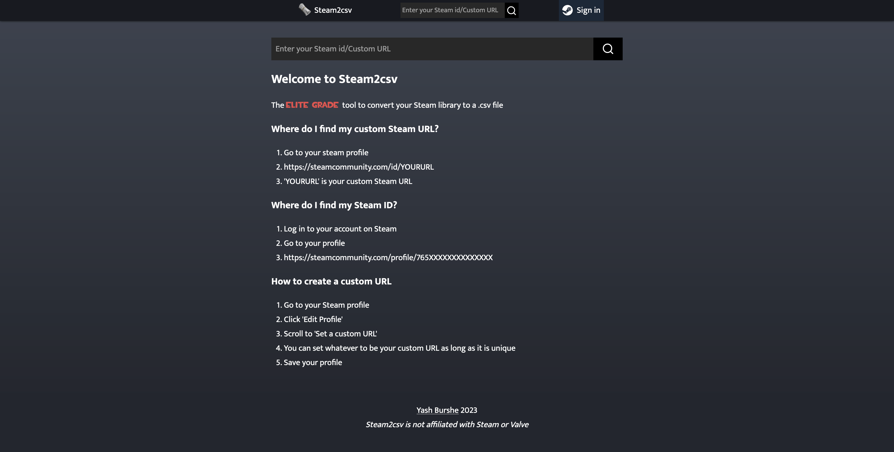
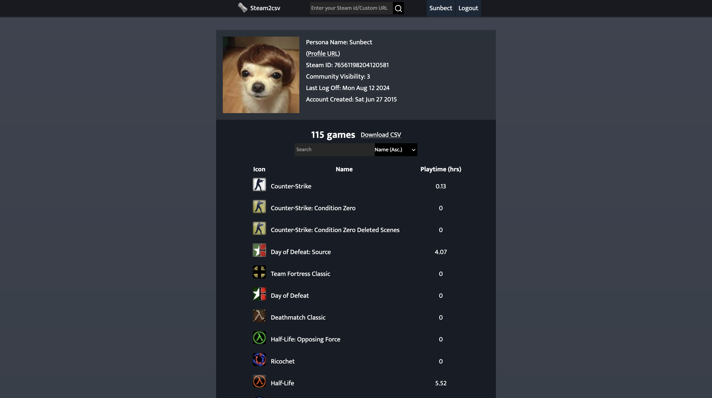
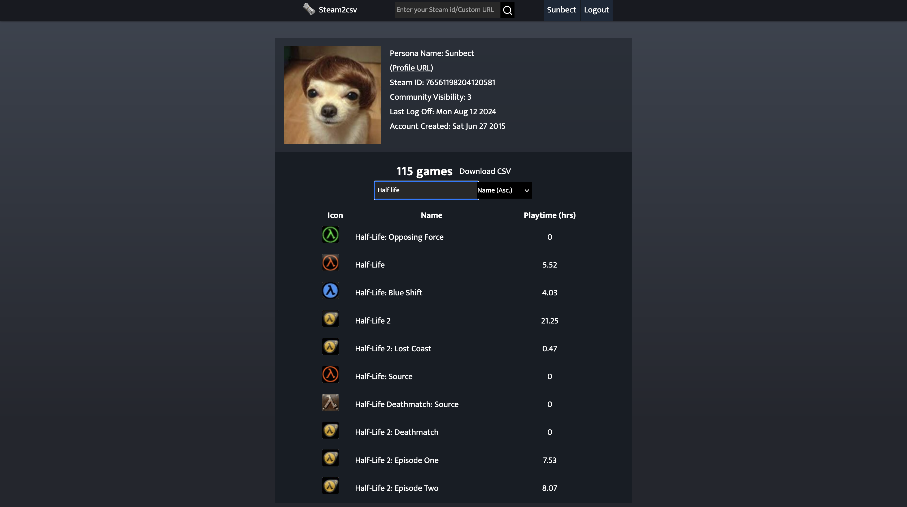
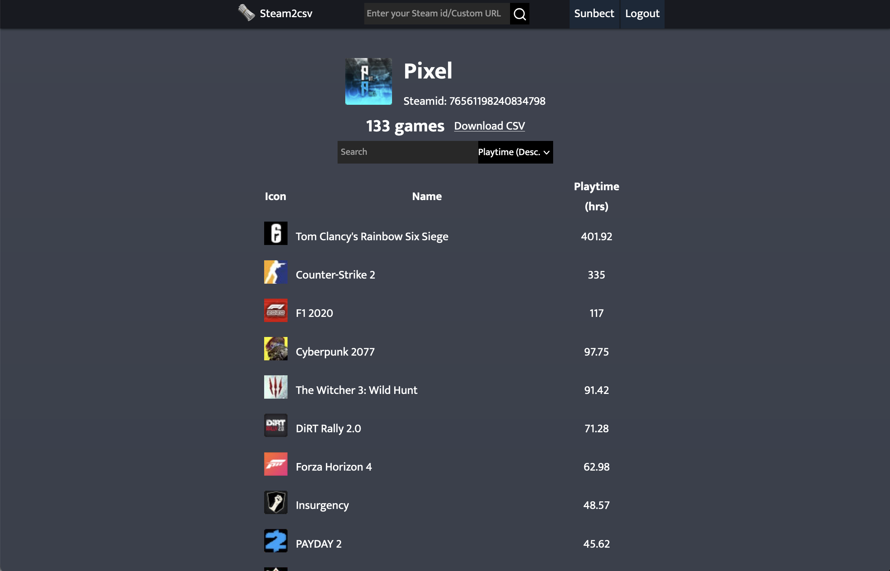

**Built using**: JavaScript and EJS

**Powered by**: Node.js, AWS EC2 and Express

Steam2CSV is a website that allows users to look up any public Steam
user's library of games and download it as a .CSV file. Users can also
view their playtime per game and sort and filter their list. It uses Steam's
own web API and OAuth server allowing users to login as well.

**Links**: [github](https://www.github.com/yburshe/steam2csv), [website](https://www.steam2csv.xyz)

## Screenshots:

